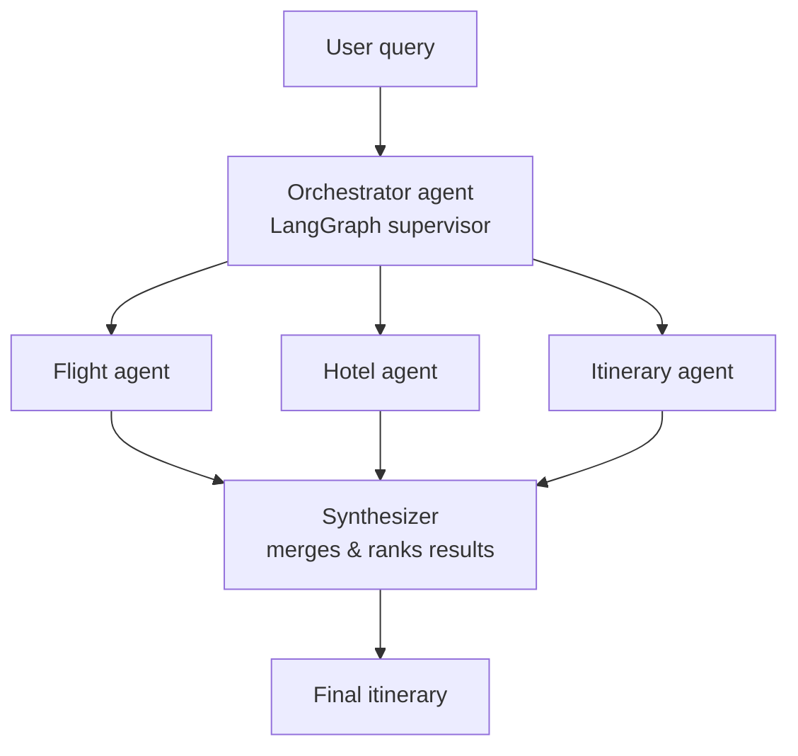
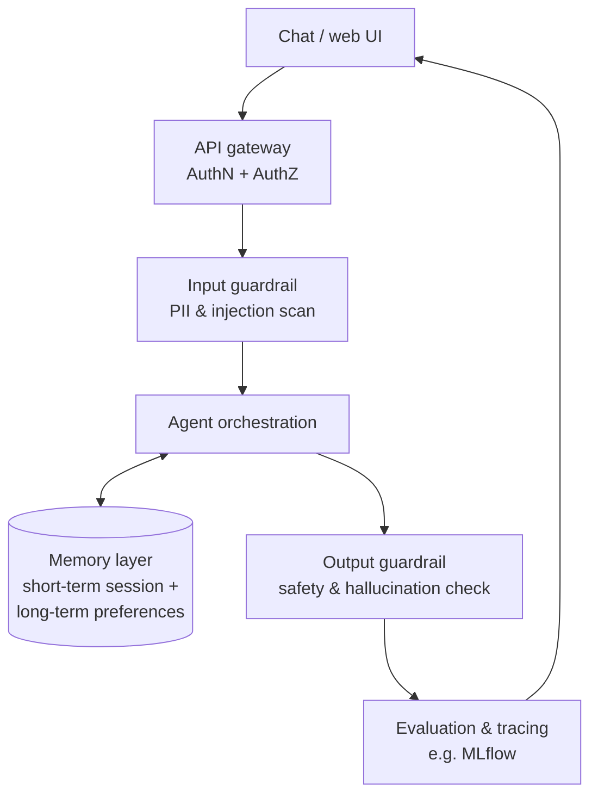

# Trip Planner Agent

An agentic AI trip planner: a LangGraph supervisor coordinates specialist
agents (flights, hotels, itinerary) instead of one large prompt doing
everything. The project is being built with production concerns in mind —
auth, guardrails, memory, and evaluation — not just a demo notebook.

## Status

Early scaffold. The module layout and tool stubs are in place; the
orchestration graph, tools, and production layers below are not yet
implemented.

## Architecture

### Agent orchestration



### Request lifecycle (planned)



## Tech stack

- Python 3.13
- LangChain / LangGraph for agent orchestration
- `uv` for packaging (see `pyproject.toml`)

## Project structure

```
src/trip_planner/
├── main.py              # entrypoint (trip-planner CLI script)
├── app.py                # app wiring
├── agents/
│   └── trip_flow.py       # orchestration graph
└── tools/
    ├── place_search.py
    ├── weather_info.py
    ├── currency_convertor.py
    └── tota_expense.py
config/
└── config.yaml
prompts/
└── prompt.py
notebook/
└── expirements.py
```

## Setup

```bash
git clone https://github.com/namratha843/trip_palanner_agent.git
cd trip_palanner_agent
uv sync                 # or: pip install -r requirements.txt
```

Run:

```bash
uv run trip-planner     # once main.py's entrypoint is implemented
```

## Roadmap

- [ ] Orchestrator graph wiring specialist agents (`trip_flow.py`)
- [ ] Tool implementations: weather, place search, currency conversion, expense totals
- [ ] Memory layer: short-term session state + long-term user preferences
- [ ] API gateway: authentication and authorization
- [ ] Input/output guardrails
- [ ] Evaluation and tracing (MLflow or equivalent)